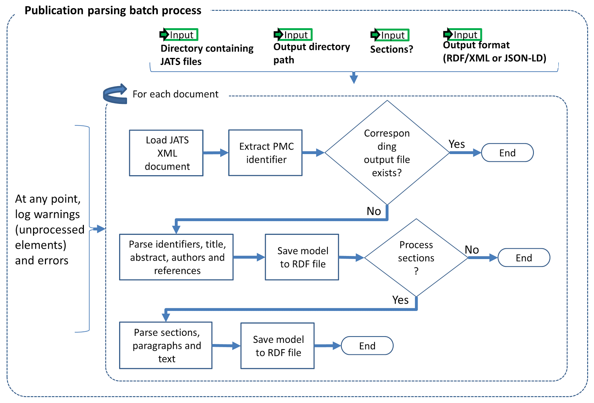
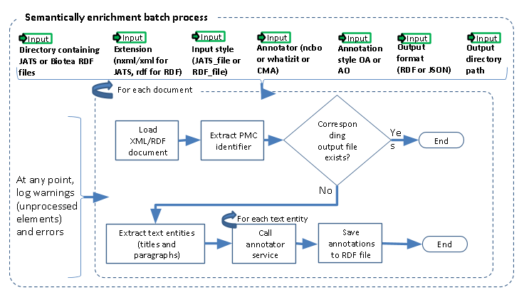

## Publication parsing process
The input to our Publication Parsing process are the articles from PMC-OA in the Journal Articles Suite (JATS) format, .i.e., XML files following a specific metamodel. Our RDFization entails generating one RDF to represent the metadata and references and another one to represent the structure --sections and paragraphs, and content --actual text.

<a href="https://github.com/biotea/biotea-rdfization" target="_blank">Get Biotea RDFization here</a>

## Semantic Enrichment Process
We identify and annotate meaningful fragments within paragraphs by using the named entity recognition (NER) service provided by the NCBO Annotator. The NCBO Annotator is part of the BioPortal platform,  it provides  access to more than 350 ontologies and terminologies. The NCBO annotator makes it possible to semantically annotate text by recognizing the entities and establishing a link  to an ontology. When doing ontology-based indexing, one might use these annotations to ’bring together’ the data elements from different resources.  The NCBO Annotator is based on Mgrep; it recognises and associates expressions in the text with unique concepts from biomedical ontologies. The NCBO Annotator utilizes to its advantage the hierarchy in the vocabularies used for the association.

<a href="https://github.com/biotea/biotea-annotation" target="_blank">Get Biotea Annotation here</a>

## Binary distribution
User Biotea .JAR distribution with the configuration used to generate the Dataset using the Biotea Generation Support scripts available <a href="https://github.com/biotea/biotea-generation-support" target="_blank">here</a>.

## Biotea Explorer Prototype
You can explore Biotea using the software prototype available <a href="http://bioteaexplorer.labs.linkingdata.io/" target="_blank">here</a>

## SWATS 2012 Biotea Prototype
Another Biotea use case was exposed in:

> García-Castro, Leyla Jael, Alexander García Castro and John Gómez. “Conceptual Exploration of Documents and Digital Libraries in the Biomedical Domain.” SWAT4LS (2012). <a href="../files/SWAT4LS_2012.pdf" target="_blank">[online]</a>