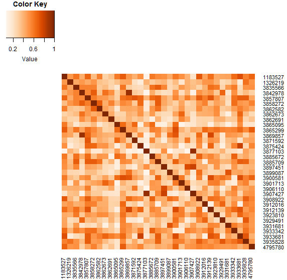

## Exploring and Experimenting Biotea with R
This is a very simple example making use of the SPARQL R package. The code passes a query to the endpoint, retrieves the results and calculates the cosine similarity. A heatmap is then generated. 

The example in this code is built upon the resulting dataset for the SNOMED CT term "Renal cell carcinoma"

